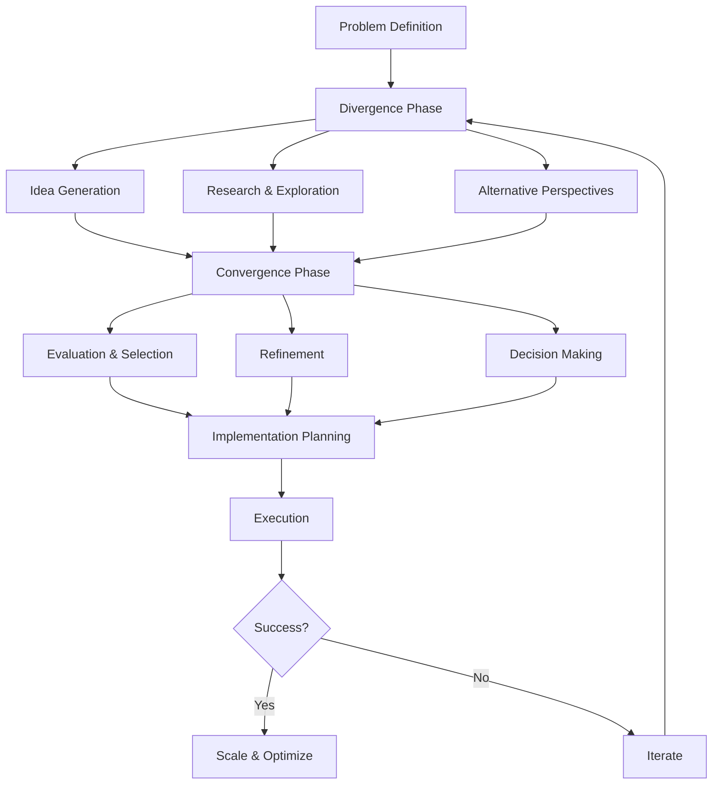
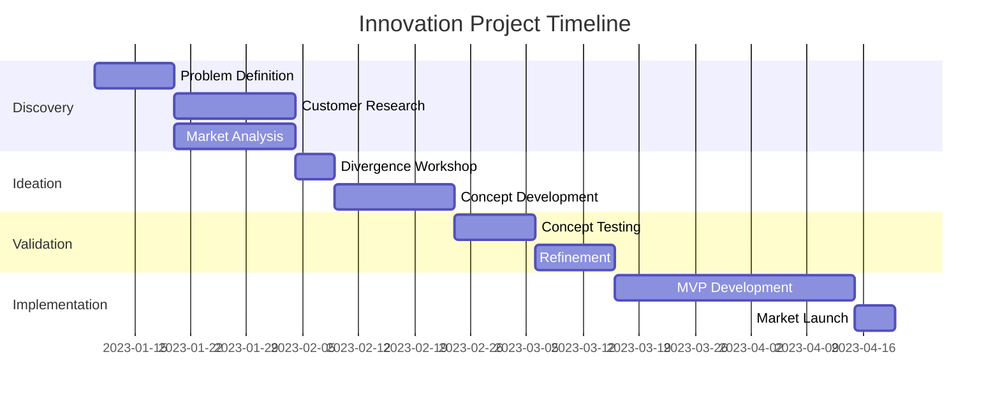
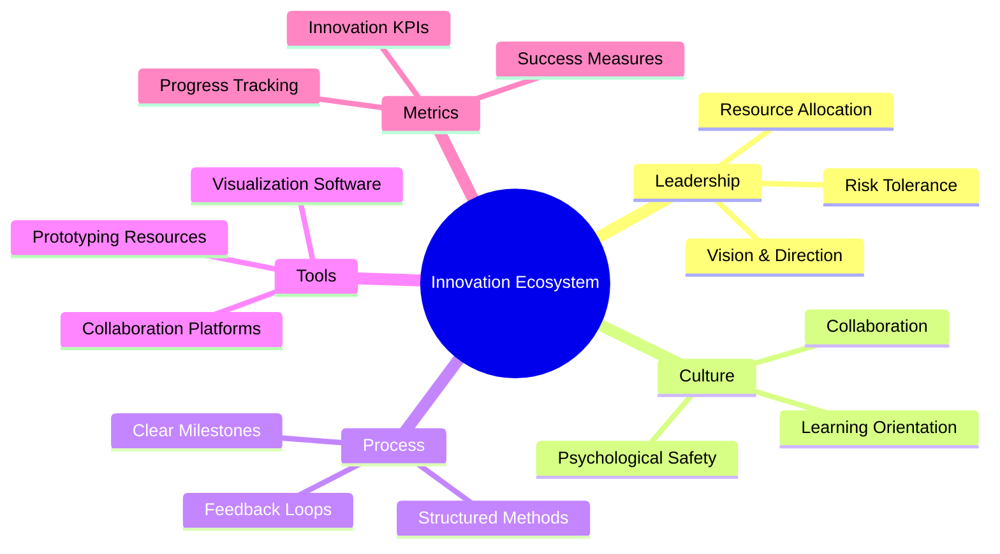
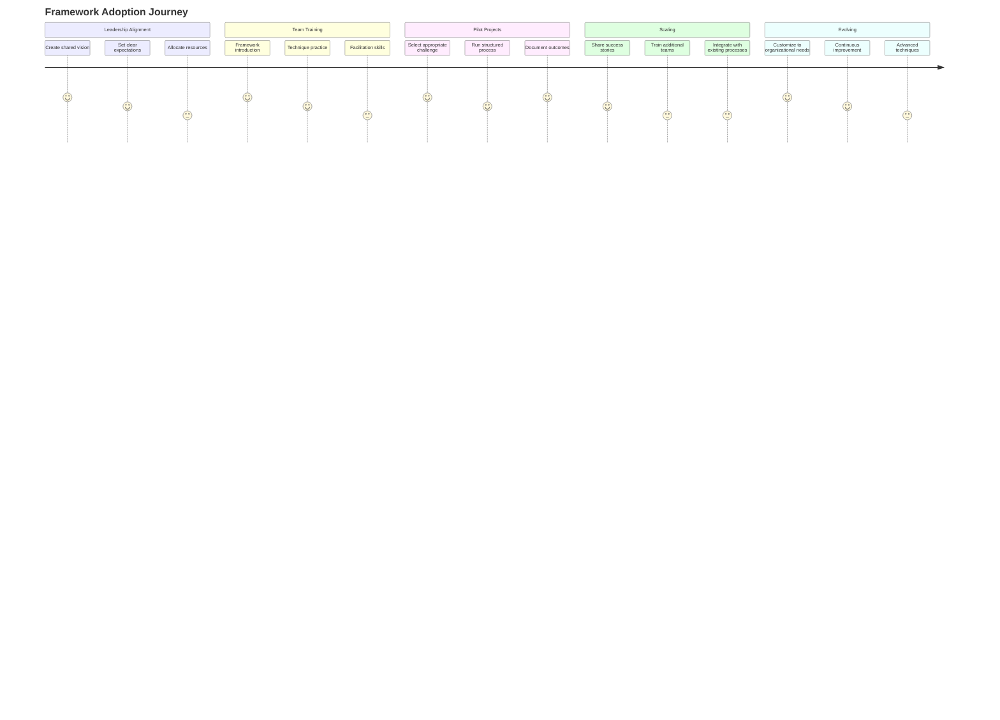

# The Divergence-Convergence Framework for Innovation

In today's rapidly evolving business landscape, organizations must continuously innovate to stay competitive. However, innovation is not a linear process—it requires both expansive thinking to generate ideas and focused execution to implement them effectively. This is where the Divergence-Convergence Framework comes into play.

## Understanding the Framework

The Divergence-Convergence Framework is a structured approach to innovation that alternates between two complementary modes of thinking:

1. **Divergence**: Expanding the solution space by generating multiple ideas, exploring different perspectives, and questioning assumptions.
2. **Convergence**: Narrowing the focus by evaluating options, making decisions, and refining solutions.

This dynamic interplay allows teams to balance creativity with practicality, ensuring that innovative ideas can be successfully implemented.

### The Process Flow

The framework follows a repeatable process that can be applied at various stages of innovation:



## Key Principles of Effective Divergence

During the divergence phase, it's essential to create an environment where creative thinking can flourish. Here are the core principles:

1. **Defer judgment**: Postpone criticism to allow ideas to develop fully
2. **Seek quantity**: Generate as many ideas as possible without filtering
3. **Welcome wild ideas**: Embrace unconventional thinking
4. **Build on others' ideas**: Use "yes, and..." thinking to expand concepts

### Divergence Techniques

| Technique | Description | Best Used For |
|-----------|-------------|--------------|
| Brainstorming | Rapid idea generation in groups | Initial ideation |
| Mind Mapping | Visual association of related concepts | Complex problems |
| SCAMPER | Systematic innovation through specific prompts | Product improvement |
| Reverse Thinking | Inverting the problem | Breaking mental blocks |

## Mastering Convergence

The convergence phase requires disciplined thinking to evaluate and refine ideas effectively. Key approaches include:

1. **Establish clear criteria**: Define parameters for success before evaluating
2. **Use data-driven methods**: Leverage metrics to guide decision-making
3. **Prototype and test**: Create minimum viable versions to validate assumptions
4. **Seek diverse perspectives**: Include different stakeholders in evaluation

### The Convergence Matrix

```mermaid
quadrantChart
    title Impact vs. Feasibility Matrix
    x-axis Low Feasibility --> High Feasibility
    y-axis Low Impact --> High Impact
    quadrant-1 "Strategic Projects" [[0.2, 0.8], [0.4, 0.9]]
    quadrant-2 "Quick Wins" [[0.7, 0.8], [0.85, 0.9]]
    quadrant-3 "Time Wasters" [[0.65, 0.15], [0.85, 0.25]]
    quadrant-4 "Operational Improvements" [[0.7, 0.4], [0.8, 0.6]]
```

This matrix helps teams prioritize ideas based on their potential impact and feasibility, focusing resources on the most promising opportunities.

## Case Study: Product Innovation Cycle

At Disequi, we applied the Divergence-Convergence Framework to develop a new digital service offering for a financial institution. The process unfolded in distinct phases:

### Phase 1: Problem Discovery



The team began by conducting extensive user research to understand pain points in the client's customer journey. Through divergent thinking, we identified over 40 potential problem areas to address.

Using our convergence criteria focused on customer impact, technical feasibility, and alignment with business strategy, we narrowed our focus to three critical challenges:

1. Onboarding complexity for new clients
2. Lack of personalized financial guidance
3. Friction in cross-service integration

## The Innovation Ecosystem

Successful application of the Divergence-Convergence Framework requires the right organizational environment. Key elements include:



## Implementation Roadmap

For organizations looking to adopt the Divergence-Convergence Framework, we recommend a phased approach:



## Measuring Innovation Success

To evaluate the effectiveness of your innovation efforts using the Divergence-Convergence Framework, we recommend tracking metrics across three dimensions:

1. **Process Metrics**: Measure the health of your innovation approach
   - Number of ideas generated
   - Time from idea to implementation
   - Diversity of perspectives involved

2. **Output Metrics**: Assess the direct results of innovation activities
   - Number of concepts prototyped
   - Projects moved to implementation
   - Patents or intellectual property generated

3. **Outcome Metrics**: Evaluate business impact
   - Revenue from new offerings
   - Cost savings from process improvements
   - Customer satisfaction improvements

## Conclusion

The Divergence-Convergence Framework provides a structured yet flexible approach to innovation that can be adapted to various organizational contexts and challenges. By deliberately alternating between expansive and focused thinking, teams can generate breakthrough ideas while ensuring practical implementation.

At Disequi, we've successfully applied this framework across industries—from healthcare to financial services to manufacturing—helping organizations transform their innovation capabilities and achieve meaningful business results.

To learn more about how your organization can implement the Divergence-Convergence Framework, contact our team for a consultation.